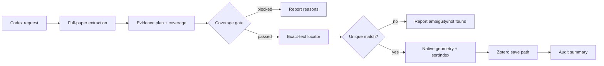

# Zotero AI Reader

Zotero AI Reader is a local-first Codex skill for complete-paper, evidence-grounded
reading and native Zotero PDF annotation. It reads the whole usable text layer,
requires coverage before writing, maps exact quotes to Zotero-compatible PDF
geometry, and keeps the analysis, locator, writer, and audit steps separate.

This is an independent community project. It is not an official Zotero product,
OpenAI product, or Zotero plugin. Zotero, Codex, and the local bridge remain
separate software that users install and operate under their own terms.

## Why this exists

Two failure modes motivated the project:

1. Abstract-only summaries can miss the paper's body evidence, methods, results,
   and limitations.
2. A useful quote is not enough for a native annotation: it must be located in
   the installed Reader text semantics and converted to the exact page rectangles
   and sort order Zotero expects.

The project therefore treats full-paper coverage as a write gate and treats
annotation geometry as a separate, testable subsystem. The design is intentionally
conservative: ambiguity is reported, not silently resolved.

## Features

- Complete, page-preserving text extraction through Zotero's installed PDF.js.
- Reader-compatible searchable text, including synthetic spacing and UTF-16 mapping.
- Exact-text lookup with context disambiguation, multi-line rectangles, and native sort order.
- Native Zotero highlights through the installed local JavaScript bridge.
- Four evidence categories with Chinese comments, tags, and stable colors.
- Coverage gate, body-evidence check, source-page validation, and duplicate protection.
- Optional structured child note generated from the final analysis plan.
- Resumable collection runner with compact JSONL audit records.
- No Computer Use, Reader-tab activation, mouse/keyboard automation, direct
  `zotero.sqlite` access, OCR, external PDF parser, or GUI fallback.

## Architecture



The implementation map is documented in [How it works](docs/how-it-works.md) and
the trade-offs are recorded in [Design decisions](docs/design-decisions.md).

## Evidence categories

| Category | Scope | Native tag | Color |
| --- | --- | --- | --- |
| `research_purpose` | research object and objective | `研究目的` | `#ffd400` |
| `research_gap` | data, method, problem-awareness, or gap | `研究缺口` | `#2ea8e5` |
| `research_method` | theory, method, variables, or workflow | `研究方法` | `#ff6666` |
| `research_result` | findings, conclusions, or limitations | `研究结果` | `#5fb236` |

## Windows installation

The supported workflow is local and requires Zotero to be installed separately.
Keep this repository in a user-owned skill directory, such as
`%USERPROFILE%\.codex\skills\zotero-ai-reader`; do not copy it into a curated
plugin cache.

1. Install and launch Zotero Desktop `9.0.6`.
2. Install the local bridge prerequisite and verify its JavaScript endpoint:

   ```powershell
   py -m pip install cli-anything-zotero
   zotero-cli app ping
   zotero-cli js "return Zotero.version"
   ```

3. From this repository, run the read-only check:

   ```powershell
   node src/doctor.mjs --json
   ```

4. Invoke the skill from Codex with `$zotero-ai-reader`, or call the documented
   Node entry points directly. The current release was verified on Windows with
   Zotero `9.0.6`, Zotero AI Reader skill/plugin `0.1.2`, Node.js `24.11.1`,
   `cli-anything-zotero`/`zotero-cli` `1.2.1`, and Zotero's bundled PDF.js.

The local bridge is a separate prerequisite and is not vendored here. The
project does not bundle Zotero, a Zotero profile, a PDF, a database, or an API
credential.

## Usage

### Read-only extraction

Extract all usable pages to a path outside the repository:

```powershell
node src/extract.mjs --attachment-key ATTACHMENT_KEY --out $env:TEMP\zotero-pages.json
```

Use `--summary` when only counts and annotation-integrity keys are needed.

### Plan and apply

The plan must contain direct quotes and coverage metadata. `source_page` is
zero-based and `source_section` identifies the section inspected during the
full-paper pass.

```powershell
node src/annotate.mjs --plan analysis.json
node src/annotate.mjs --plan analysis.json --apply
node src/annotate.mjs --plan analysis.json --apply --note
```

The dry run never writes. The apply path re-extracts the PDF, checks coverage,
locates every quote, refuses unresolved ambiguity, and only then calls the
native Zotero writer.

For collections:

```powershell
node src/run.mjs --collection "Collection name or key" --plan analysis-set.json --apply --audit .codex/audit.jsonl
```

Use `--force` only when intentionally retrying a completed item/attachment pair.
Audit records contain counts and statuses, not full PDF text.

### Plan shape

```json
{
  "attachmentKey": "PDF_ATTACHMENT_KEY",
  "coverage": {
    "totalPages": 10,
    "pagesWithUsableText": 10,
    "pagesInspected": 10,
    "coverageComplete": true,
    "sectionsSeen": ["Abstract", "1 Introduction", "Methods", "Results"],
    "abstractPageIndices": [0]
  },
  "research_purpose": [
    {
      "exact_quote": "direct body evidence",
      "context_before": "optional preceding text",
      "context_after": "optional following text",
      "summary_zh": "中文摘要",
      "source_page": 1,
      "source_section": "1 Introduction"
    }
  ],
  "research_gap": [],
  "research_method": [],
  "research_result": []
}
```

Quotes must be copied from the paper. Context is used to disambiguate a match
but is not highlighted unless it is included in `exact_quote`.

## Safety, privacy, and limitations

- Run a dry run and keep a backup before any native write.
- Native writes go through Zotero's in-process annotation save path; this project
  never edits `zotero.sqlite` directly.
- Private plans, extraction output, PDFs, databases, credentials, and logs belong
  outside Git. See [SECURITY.md](SECURITY.md).
- OCR-only PDFs, missing text layers, unusual page rotation, dedicated ligature
  edge cases, and Zotero versions other than `9.0.6` are unsupported or
  `[UNVERIFIED]`.
- The software does not judge research quality or replace human verification.
  Exact geometry does not make an interpretation correct.
- A write changes the user's Zotero library. Review the plan and the dry-run
  result before using `--apply`.

## Testing

The public test suite uses synthetic structured characters and does not need a
private paper:

```powershell
npm test
node src/doctor.mjs --json
```

The private integration harness is opt-in through a user-supplied
`ZOTERO_INTEGRATION_CONFIG` with `ZOTERO_INTEGRATION=1`; never commit that
configuration or its output.

## Community and license

Contributions are welcome; see [CONTRIBUTING.md](CONTRIBUTING.md). Security
reports should follow [SECURITY.md](SECURITY.md). Release history is in
[CHANGELOG.md](CHANGELOG.md).

The project is released under the [MIT License](LICENSE). External runtime
licenses and design acknowledgements are listed in
[docs/acknowledgements.md](docs/acknowledgements.md). The project uses the
Codex skill packaging model described in the [official Codex skill
documentation](https://developers.openai.com/codex/skills/) and the Zotero
runtime documented by [Zotero](https://www.zotero.org/support/dev/source_code);
neither upstream project is being redistributed here.
